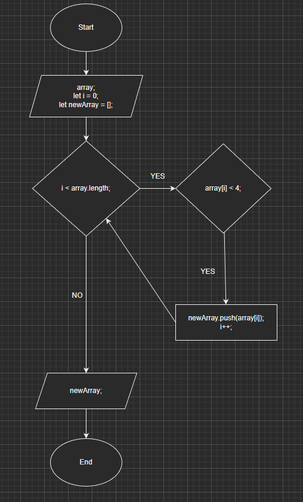
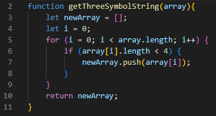
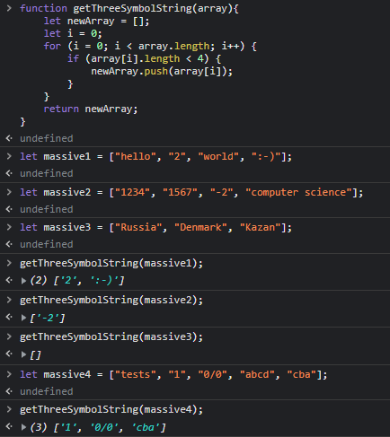

# Итоговая проверочная работа.

## **Задача:**

### Написать программу, которая из имеющегося массива строк формирует новый массив из строк, длина которых меньше, либо равна 3 символам. Первоначальный массив можно ввести с клавиатуры, либо задать на старте выполнения алгоритма.

**Примеры:**

[“Hello”, “2”, “world”, “:-)”] → [“2”, “:-)”]

[“1234”, “1567”, “-2”, “computer science”] → [“-2”]

[“Russia”, “Denmark”, “Kazan”] → []

## Алгоритм.

## Код программы:

### *Код программы написан на языке JavaScript.* 

## Пояснение к решению.

### На вход программы поступает массив. Внутри функции объявляем пустой массив в который будут добавляться валидные строки, так же объявляем итератор вне цикла (просто так, можно и в цикле). Начинаем циклом обходить массив, который приходит на вход и длинну каждого элемента массива сравнивать с 4 (строго меньше 4, можно сделать <= 3), если строка нас устраивает, то добавляем её в пустой массив, который инициализировали ранее, если нет, то продолжаем идти по массиву, который пришел на вход. В конечном итоге, функция возвращает либо пустой массив, если нет валидных строк, либо массив со всеми валидными строками.

## Тесты.

