# Семинар 1. Домашнее задание.

### Задание №2.

Напишите программу, которая на вход принимает два числа и выдаёт, какое число большее, а какое меньшее.

a = 5; b = 7 -> max = 7

a = 2 b = 10 -> max = 10

a = -9 b = -3 -> max = -3

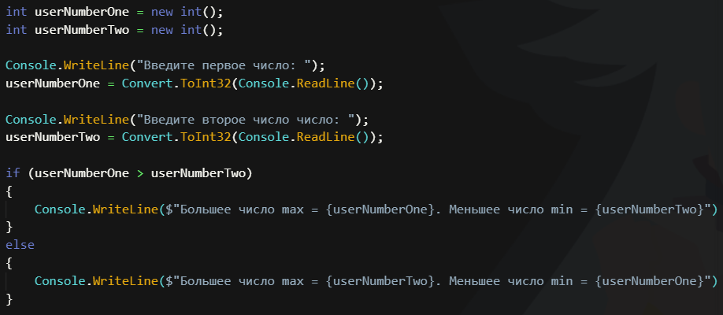

### Задание №4.

Напишите программу, которая принимает на вход три числа и выдаёт максимальное из этих чисел.

2, 3, 7 -> 7

44 5 78 -> 78

22 3 9 -> 22

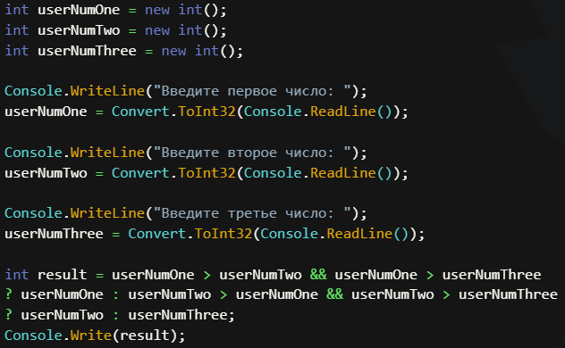

### Задание №6.

Напишите программу, которая на вход принимает число и выдаёт, является ли число чётным (делится ли оно на два без остатка).

4 -> да

-3 -> нет

7 -> нет

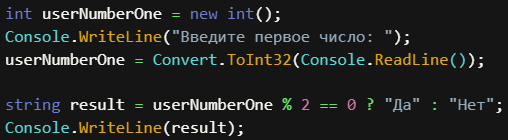
### Задание №8.

Напишите программу, которая на вход принимает число (N), а на выходе показывает все чётные числа от 1 до N.

5 -> 2, 4

8 -> 2, 4, 6, 8

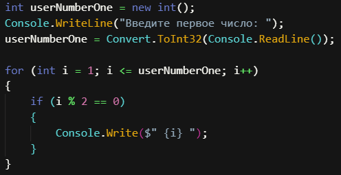

### Задание №10.

Напишите программу, которая принимает на вход трёхзначное число и на выходе показывает вторую цифру этого числа.

456 -> 5

782 -> 8

918 -> 1

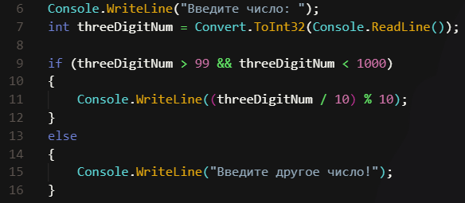
### Задание №13.

Напишите программу, которая выводит третью цифру 
заданного числа или сообщает, что третьей цифры нет.

645 -> 5

78 -> третьей цифры нет

32679 -> 6

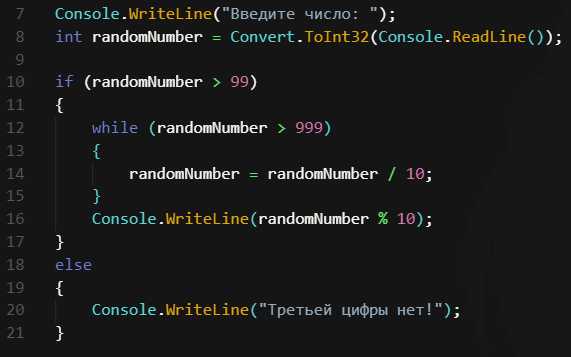
### Задание №15.

Напишите программу, которая принимает на вход цифру, обозначающую день недели, и проверяет, является ли этот день выходным.

6 -> да

7 -> да

1 -> нет

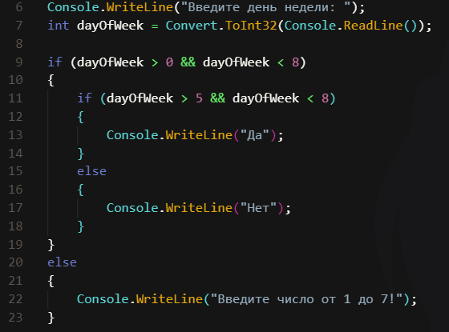

### Задание №19.

Напишите программу, которая принимает на вход пятизначное число и проверяет, является ли оно палиндромом.

14212 -> нет

12821 -> да

23432 -> да

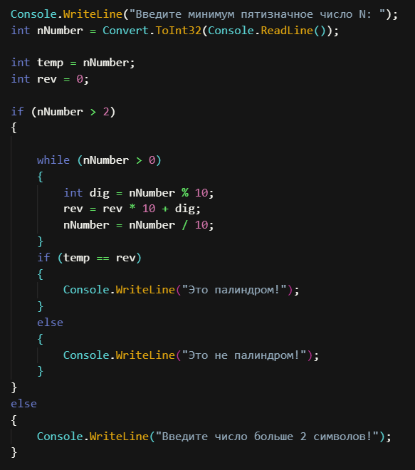

### Задание №21.

Напишите программу, которая принимает на вход координаты двух точек и находит расстояние между ними в 3D пространстве.

A (3,6,8); B (2,1,-7), -> 15.84

A (7,-5, 0); B (1,-1,9) -> 11.53

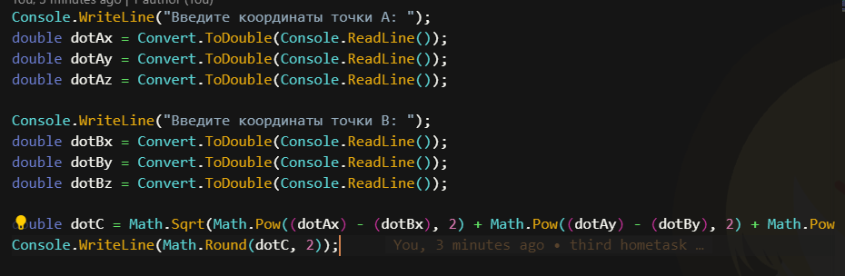

### Задание №23.

Напишите программу, которая принимает на вход число (N) и выдаёт таблицу кубов чисел от 1 до N.

3 -> 1, 8, 27

5 -> 1, 8, 27, 64, 125

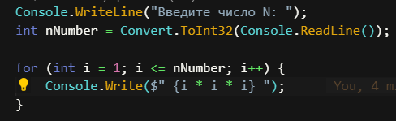

### Задание №25.

Напишите цикл, который принимает на вход два числа (A и B) и возводит число A в натуральную степень B.

3, 5 -> 243 (3⁵)

2, 4 -> 16

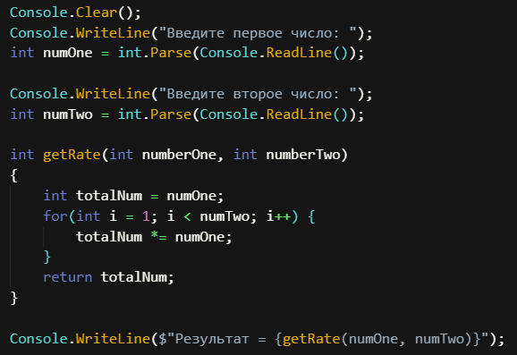

### Задание №27.

Напишите программу, которая принимает на вход число и выдаёт сумму цифр в числе.

452 -> 11

82 -> 10

9012 -> 12

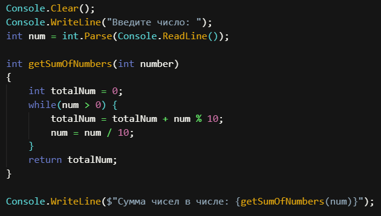

### Задание №29.

Напишите программу, которая задаёт массив из 8 элементов и выводит их на экран.

1, 2, 5, 7, 19 -> [1, 2, 5, 7, 19]

6, 1, 33 -> [6, 1, 33]

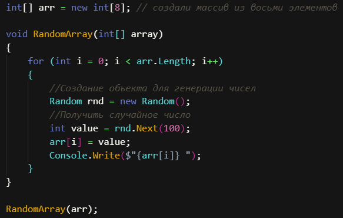