# Семинар 1. Домашнее задание.

### Задание №2.

Напишите программу, которая на вход принимает два числа и выдаёт, какое число большее, а какое меньшее.

a = 5; b = 7 -> max = 7

a = 2 b = 10 -> max = 10

a = -9 b = -3 -> max = -3

### Задание №4.

Напишите программу, которая принимает на вход три числа и выдаёт максимальное из этих чисел.

2, 3, 7 -> 7

44 5 78 -> 78

22 3 9 -> 22

### Задание №6.

Напишите программу, которая на вход принимает число и выдаёт, является ли число чётным (делится ли оно на два без остатка).

4 -> да

-3 -> нет

7 -> нет

### Задание №8.

Напишите программу, которая на вход принимает число (N), а на выходе показывает все чётные числа от 1 до N.

5 -> 2, 4

8 -> 2, 4, 6, 8

### Задание №10.

Напишите программу, которая принимает на вход трёхзначное число и на выходе показывает вторую цифру этого числа.

456 -> 5

782 -> 8

918 -> 1

### Задание №13.

Напишите программу, которая выводит третью цифру 
заданного числа или сообщает, что третьей цифры нет.

645 -> 5

78 -> третьей цифры нет

32679 -> 6

### Задание №15.

Напишите программу, которая принимает на вход цифру, обозначающую день недели, и проверяет, является ли этот день выходным.

6 -> да

7 -> да

1 -> нет

### Задание №19.

Напишите программу, которая принимает на вход пятизначное число и проверяет, является ли оно палиндромом.

14212 -> нет

12821 -> да

23432 -> да

### Задание №21.

Напишите программу, которая принимает на вход координаты двух точек и находит расстояние между ними в 3D пространстве.

A (3,6,8); B (2,1,-7), -> 15.84

A (7,-5, 0); B (1,-1,9) -> 11.53

### Задание №23.

Напишите программу, которая принимает на вход число (N) и выдаёт таблицу кубов чисел от 1 до N.

3 -> 1, 8, 27

5 -> 1, 8, 27, 64, 125

### Задание №25.

Напишите цикл, который принимает на вход два числа (A и B) и возводит число A в натуральную степень B.

3, 5 -> 243 (3⁵)

2, 4 -> 16

### Задание №27.

Напишите программу, которая принимает на вход число и выдаёт сумму цифр в числе.

452 -> 11

82 -> 10

9012 -> 12

### Задание №29.

Напишите программу, которая задаёт массив из 8 элементов и выводит их на экран.

1, 2, 5, 7, 19 -> [1, 2, 5, 7, 19]

6, 1, 33 -> [6, 1, 33]

### Задание №34.

Задайте массив заполненный случайными положительными трёхзначными числами. 
Напишите программу, которая покажет количество чётных чисел в массиве.

[345, 897, 568, 234] -> 2

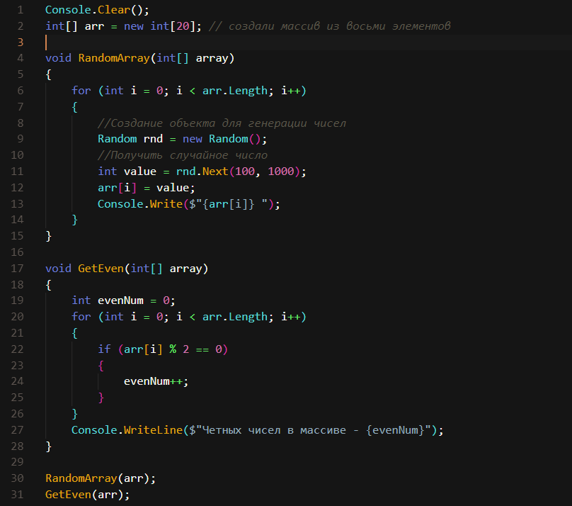

### Задание №36.

Задайте одномерный массив, заполненный случайными числами. Найдите сумму элементов, стоящих на нечётных позициях(по индексу считаем).

[3, 7, 23, 12] -> 19

[-4, -6, 89, 6] -> 0

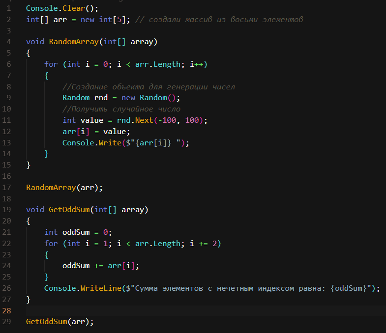

### Задание №38.

Задайте массив вещественных чисел. 
Найдите разницу между максимальным и минимальным элементов массива.

[3 7 22 2 78] -> 76

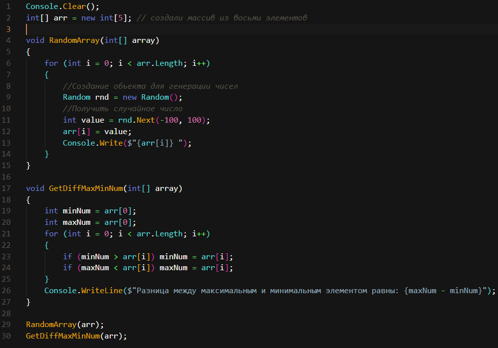
### Задание №41.

Пользователь вводит с клавиатуры M чисел. Посчитайте, сколько чисел больше 0 ввёл пользователь.

0, 7, 8, -2, -2 -> 2

1, -7, 567, 89, 223-> 3

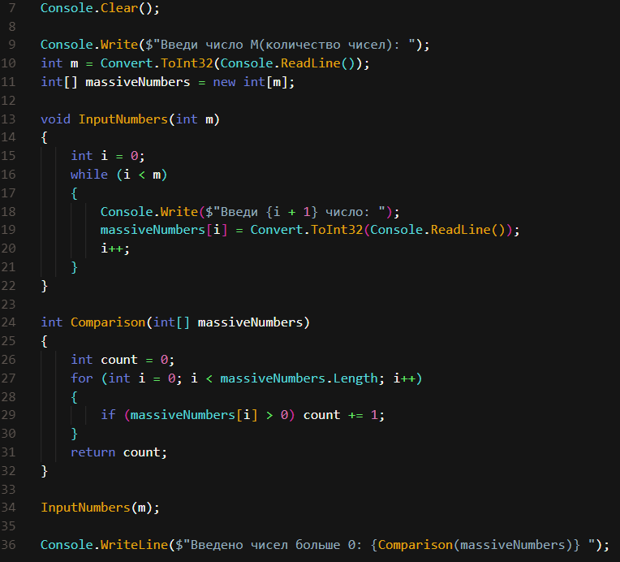
### Задание №43.

Напишите программу, которая найдёт точку пересечения двух прямых, 
заданных уравнениями y = k1 * x + b1, y = k2 * x + b2; 
значения b1, k1, b2 и k2 задаются пользователем.

b1 = 2, k1 = 5, b2 = 4, k2 = 9 -> (-0,5; -0,5)

### Задание №47.

Задайте двумерный массив размером m×n, заполненный случайными вещественными числами.

m = 3, n = 4.

0,5 7 -2 -0,2

1 -3,3 8 -9,9

8 7,8 -7,1 9

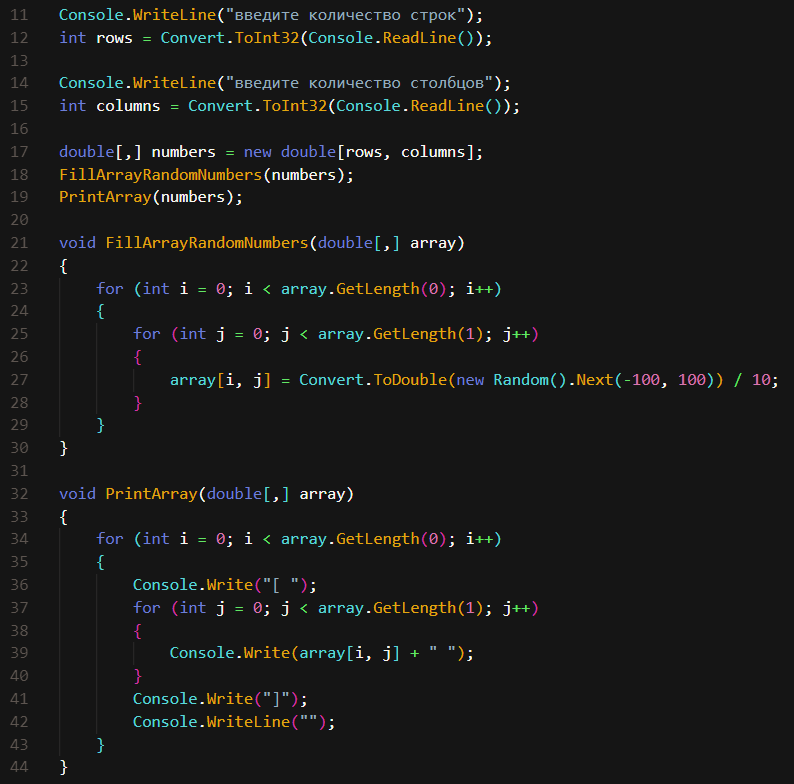

### Задание №50.

Напишите программу, которая на вход принимает позиции элемента в двумерном массиве, и возвращает значение этого элемента или же указание, что такого элемента нет.(на вход именно поступает позиция элемента, можете разбить на две переменные или прописать в одну строку и конвертировать в два числа, комментарии в конце семинара по этой задаче)

Например, задан массив:

1 4 7 2

5 9 2 3

8 4 2 4

17 -> такого числа в массиве нет

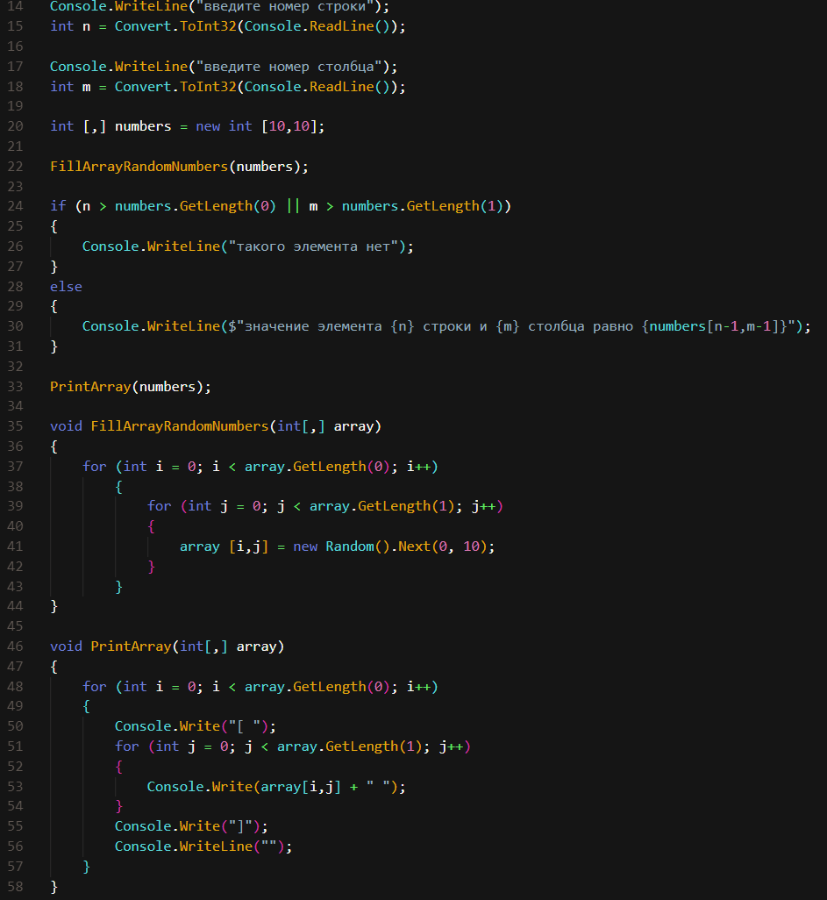

### Задание №52.

Задайте двумерный массив из целых чисел. Найдите среднее арифметическое элементов в каждом столбце.

Например, задан массив:
1 4 7 2

5 9 2 3

8 4 2 4
Среднее арифметическое каждого столбца: 4,6; 5,6; 3,6; 3.

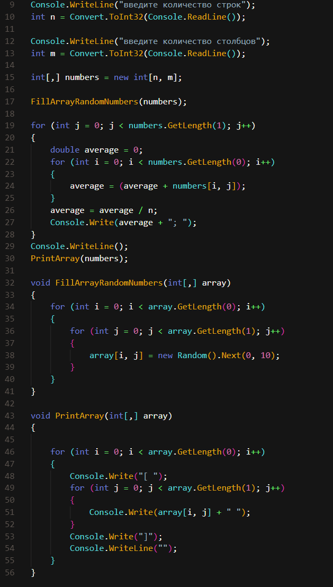

### Задание №54.

Задайте двумерный массив. Напишите программу, которая упорядочит по убыванию элементы каждой строки двумерного массива.
Например, задан массив:

1 4 7 2

5 9 2 3

8 4 2 4

В итоге получается вот такой массив:

7 4 2 1

9 5 3 2

8 4 4 2

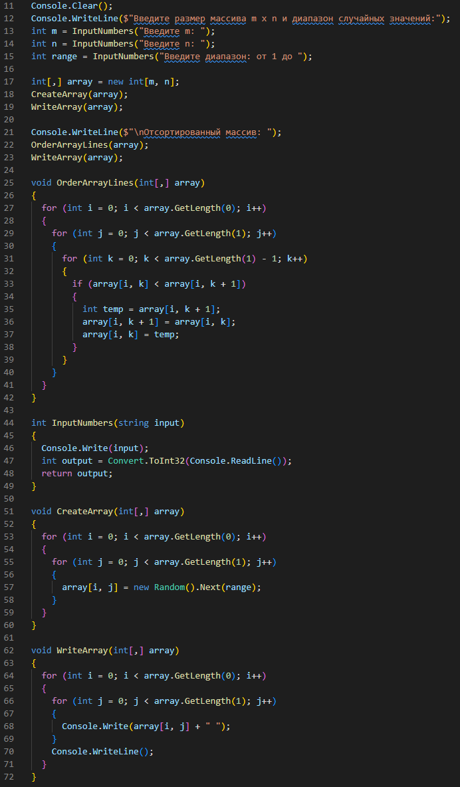

### Задание №56.

Задайте прямоугольный двумерный массив. Напишите программу, которая будет находить строку с наименьшей суммой элементов.

Например, задан массив:

1 4 7 2

5 9 2 3

8 4 2 4

5 2 6 7

Программа считает сумму элементов в каждой строке и выдаёт номер строки с наименьшей суммой элементов: 1 строка

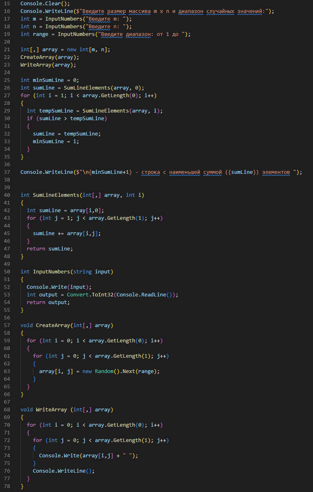

### Задание №58.

Задайте две матрицы. Напишите программу, которая будет находить произведение двух матриц.
Например, даны 2 матрицы:

2 4 | 3 4

3 2 | 3 3

Результирующая матрица будет:

18 20

15 18

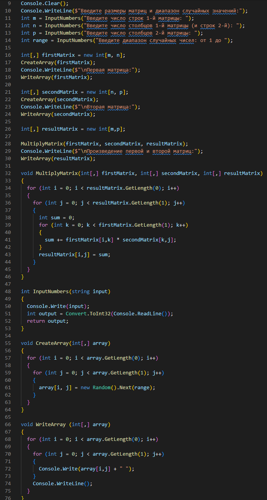

### Задание №60.

Сформируйте трёхмерный массив из неповторяющихся двузначных чисел. 
Напишите программу, которая будет построчно выводить массив, добавляя индексы каждого элемента.

Массив размером 2 x 2 x 2

66(0,0,0) 25(0,1,0)

34(1,0,0) 41(1,1,0)

27(0,0,1) 90(0,1,1)

26(1,0,1) 55(1,1,1)

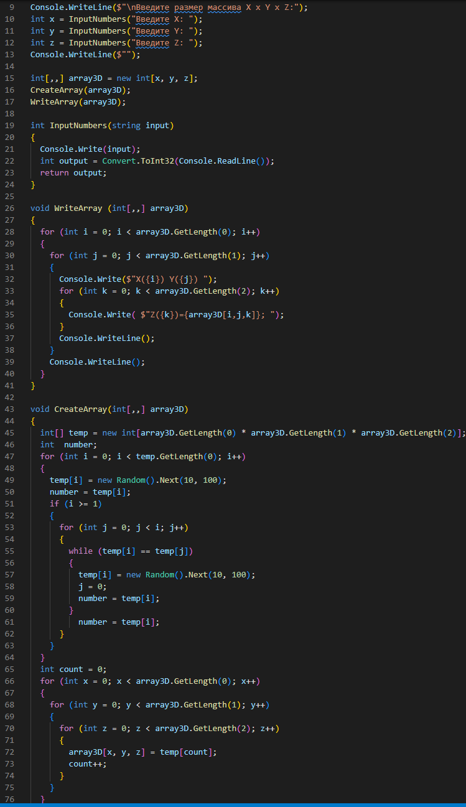

### Задание №62.

Напишите программу, которая заполнит спирально массив 4 на 4. ( - необязательная)

Например, на выходе получается вот такой массив:

01 02 03 04

12 13 14 05

11 16 15 06

10 09 08 07

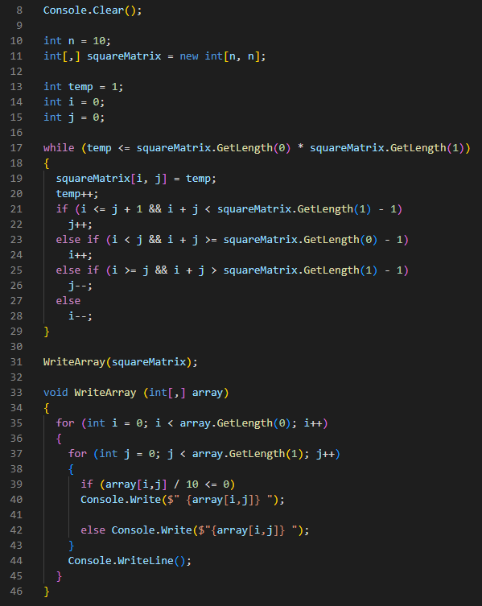

### Задание №64.

Задайте значения M и N. Напишите программу, которая выведет все натуральные числа в промежутке от M до N от большего к меньшему.

M = 1; N = 5. -> ""5, 4, 3, 2, 1""

M = 4; N = 8. -> ""8, 7, 6, 5, 4""

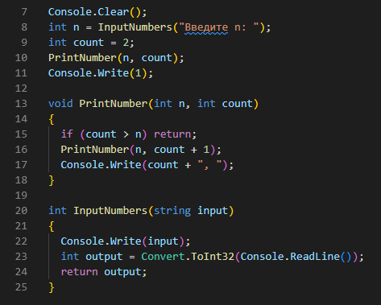

### Задание №66.

Задайте значения M и N. Напишите программу, которая найдёт сумму чётных чисел натуральных элементов в промежутке от M до N.

M = 1; N = 15 -> 56

M = 4; N = 8. -> 18

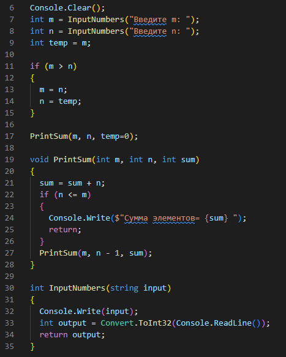

### Задание №68.

Напишите программу вычисления функции Аккермана с помощью рекурсии. Даны два неотрицательных числа m и n.(необязательная)

m = 2, n = 3 -> A(m,n) = 9

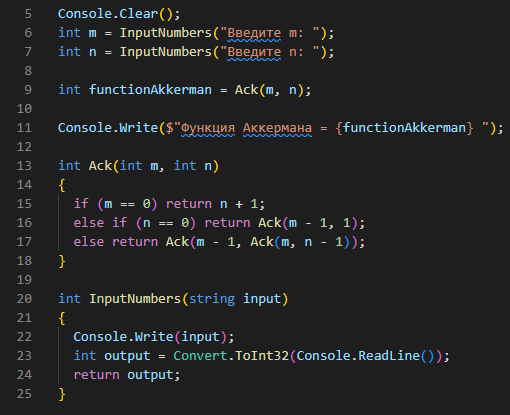